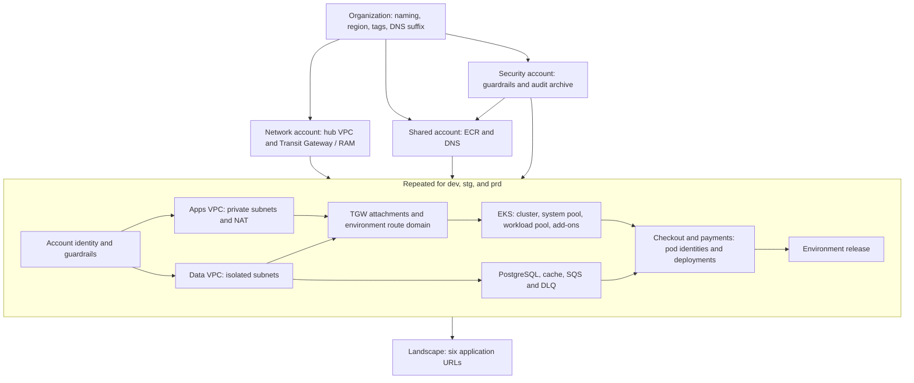

# Complete AWS landscape, without AWS

This example models six AWS member accounts, seven VPCs, three EKS platforms,
and six applications using **63 independent roots in 12 execution levels**.
The directory is named `compelete` intentionally to match the requested example path.

Every root is a checked-in local fixture using the built-in `terraform_data`
resource. Terraform/OpenTofu really initializes isolated backends, plans,
applies, reads outputs, and destroys state. The AWS identifiers and service
settings are simulated data. There are no AWS, Kubernetes, Helm, random, or
local provider downloads, remote Terraform modules, provisioners, containers,
cloud API calls, or credentials. No EKS cluster or AWS resource is created.

Use Terraform **>= 1.4, < 2.0** or OpenTofu **>= 1.6, < 2.0** on PATH. The
fixtures use `.tf` syntax common to both. The walkthrough was exercised with
Terraform 1.5.7 and OpenTofu 1.11.0. Kubernetes `1.34` is sample input, not an
assertion about currently supported EKS versions. Local default-workspace
state is the only backend used by the runnable example.

`terraform_data` is available without an external provider installation;
see the [Terraform resource reference](https://developer.hashicorp.com/terraform/language/resources/terraform-data)
and [OpenTofu built-in provider](https://opentofu.org/docs/language/providers/builtin/).
The comment-only `.terraform.lock.hcl` files intentionally record no provider
selections: Terragraph's read-only output/status preparation still requires
a lockfile to exist. Keep those files with the example.

## Architecture



| Member account | Fictional ID | VPC CIDRs | Responsibility |
|---|---|---|---|
| security | `111111111111` | None | Audit archive, telemetry, encryption key fixture |
| network | `222222222222` | `10.0.0.0/16` | Hub VPC, TGW, RAM sharing, separate route domains |
| shared | `333333333333` | None | Shared registry, cross-account pull intent, DNS suffix |
| dev | `444444444444` | Apps `10.16.0.0/16`, data `10.17.0.0/16` | Spot workload pool, one NAT, one cache node, one replica per app |
| stg | `555555555555` | Apps `10.32.0.0/16`, data `10.33.0.0/16` | On-demand workload pool, multi-AZ database, two replicas |
| prd | `666666666666` | Apps `10.48.0.0/16`, data `10.49.0.0/16` | Three NATs, four workload nodes, three cache nodes and replicas, 35 backup days |

All accounts inherit Seoul and the `ane2` naming abbreviation from the
organization. Each VPC defaults to three AZs derived from that region; an
explicit `availability_zones` list can override them. Data VPCs have no NAT.
The fixture records private service endpoints and explicitly empty
cross-environment routes. These values describe intended network isolation;
they do not prove real AWS routing, IAM permissions, availability, or security.

Naming follows `acme-ane2-<resource>-<stage>-<purpose>`, with `Namespace` in
tags. Shared identifiers include their account when needed. Account IDs,
ARNs, image addresses, credentials, and `.invalid` endpoints are examples.
The fake database password exists solely to exercise sensitive data edges.

## Run it

From the repository root:

```sh
make build
cd examples/compelete
../../terragraph validate
../../terragraph graph
../../terragraph graph --format dot > /tmp/compelete.dot
../../terragraph apply --auto-approve --parallelism 4
../../terragraph output --node landscape
../../terragraph output summary --node landscape --raw
../../terragraph status --node prd.platform.cluster --output json
../../terragraph apply --auto-approve --parallelism 4
../../terragraph plan --parallelism 4
```

The first apply reports 63 applied nodes. The second reports 63 unchanged
nodes. `landscape` lists both applications in all three environments; for
example, `https://checkout.prd.commerce.example.invalid`.

Commands load **the directory**, merging `blueprint.hcl`, `environments.hcl`,
`settings.hcl`, and `contracts.hcl`. Do not select `blueprint.hcl` alone:
that would omit the environment instances, strict contract mode, and other
settings. From elsewhere, pass `--blueprint /path/to/examples/compelete`.

Add `--tofu` consistently to use OpenTofu in a fresh copy. Keep a given
checkout's states and retained plans on the same runtime; the verification
script creates separate copies for each runtime automatically.

A fresh whole-graph `plan` cannot predict missing upstream outputs. Ordinary
`apply` bootstraps this graph with real upstream results. After bootstrap,
`plan` uses existing upstream state, even if an upstream plan proposes a
different value. Use saved frontiers below for a separate review step.

## Where the repetition went

| File or directory | Owns |
|---|---|
| `blueprint.hcl` | Organization values and the three shared accounts/services |
| `environments.hcl` | Three instances containing only their account and sizing/network/application differences |
| `groups/account` | Identity, group-scoped guardrail contracts, and a context export that waits for guardrails |
| `groups/network` | Two uses of the same VPC root, TGW connectivity, context fan-out |
| `groups/eks` | Cluster, two uses of the node-pool root, add-on ordering |
| `groups/data` | Database, cache, queue, and a sensitive credentials export |
| `groups/service` | Per-service pod identity and deployment |
| `groups/environment` | Nested composition and all connections between the layers |
| `contracts.hcl` | Source-scoped producer and consumer declarations reused across instances |
| `settings.hcl` | Enforced contracts, snapshots, temporary inputs, execution retention |
| `modules` | Eighteen small, always-present root fixtures with typed inputs and apply-time outputs |

`use.vars` fills exported inputs; it is not an override map. For example,
one environment `data_config` fans out to the database and cache, and one
`context` fans out through nested groups. The fixed system pool is defined
once inside the EKS group. Account context flows from applied outputs,
so it does not need to be copied into every leaf's `vars`.

Blueprint `vars` supports literal data, without functions, locals, variable
references, loops, or interpolation of node names into backend keys. The
three `use "environment"` declarations and their external edges remain
explicit. Naming, AZ defaults, and subnet calculations belong in the local
fixtures. Adding `qa` means adding an instance, unique CIDRs/account data,
its shared-service edges, and an export consumer if it should appear in
the final landscape. No group implementation needs to be copied.

There are scalar port edges, nested multi-input edges, and ordering-only
edges. `use.network -> use.platform` waits for the connectivity sink before
starting the platform roots. Pool-to-add-on ordering waits for capacity
without inventing a data input just to express sequencing.

Each leaf has its own `.terragraph/state/<qualified-name>.tfstate` and
`.terragraph/tfdata/<qualified-name>/`, including seven instances of the
same VPC source. Modules declare `backend "local" {}` so Terragraph can
supply an absolute path. Module sources remain unchanged by execution.
Group and leaf names are state addresses: renaming a leaf is a migration
decision, not a cosmetic edit.

## Contracts and actual values

Every data edge has both a producer and consumer contract with type,
nullability, and sensitivity claims. Contracts are keyed by source, so a
single VPC declaration covers the hub and all six environment VPCs. All
claims run under `contracts { mode = "enforce" }`.
The account group carries its own guardrail contracts, which are merged
when the group is instantiated in six places.

The credentials path is sensitive end to end:

```text
database.credentials -> data export -> environment wiring
                     -> service export -> workload.credentials
```

```sh
../../terragraph output --node dev.data.database --output json
../../terragraph output credentials --node dev.data.database --show-sensitive
```

The first command redacts credentials. The second explicitly reveals the
fake value. Snapshots store consumed non-sensitive outputs and record
`credentials` in `withheld`. Sensitive inputs still exist in native state,
temporary input files while running, retained plan bytes, and native state
backups. Sensitivity is not encryption or a replacement for access control.

Contracts compare declarations, not returned values. They do not validate
that a producer returned the promised type or that a VPC belongs to an
account. Fixture preconditions separately reject incorrect account/VPC
connections, public production EKS endpoints, insufficient production
database retention, and undersized production cache configurations.
The runnable verifier demonstrates a plan that passes contract validation
but fails the production endpoint precondition.

`optional(...)` defaults belong in module variables. Contract type strings
use the one-argument optional form accepted by the current contract parser.
Non-null claims describe these always-present roots; disabling a resource
would require redesigning its contract and downstream graph.

## Day-two operations

An exact leaf selection never expands to its parents or consumers:

```sh
../../terragraph plan --node dev.checkout.deployment
../../terragraph apply --node dev.checkout.deployment --auto-approve
../../terragraph run --node dev.checkout.deployment -- state list
../../terragraph run --node dev.checkout.deployment -- state show terraform_data.this
../../terragraph plan list --output json
```

Change dev's checkout image tag in `environments.hcl` and apply the graph to
observe downstream propagation. Leave an unchanged environment alone; a
leaf-only apply will not update its release or the final landscape for you.

The default `safe` policy permits create/update and refuses replacement.
Changing a VPC CIDR triggers replacement in this fixture. `--auto-approve`
does not bypass that refusal. `--approve none` can reject all resource
changes on nodes without a standing policy. It is not a preview mode.
The disposable landscape node explicitly declares `all`; production's
environment explicitly declares `safe`, inherited by its 17 leaves.
CLI `--approve all` cannot widen that production declaration.

To tear down this local example, change only production's `approve` from
`safe` to `all` in `environments.hcl`, then run:

```sh
../../terragraph destroy --auto-approve --parallelism 4
```

Destroy runs the 12 levels in reverse. Restore production's `safe` policy
afterwards. For an isolated scratch copy, the verifier performs this edit
and cleanup automatically. There is no real infrastructure rollback here;
reapplying recreates local fixture state. Preserve failed execution evidence
until recovery is understood, rather than deleting `.terragraph` to retry.

## Reviewed plans and recovery

From a fresh copy:

```sh
../../terragraph plan --save --output json
../../terragraph plan show <run-id> --output json
../../terragraph apply --plan <run-id> --auto-approve
../../terragraph plan --save --continue <run-id> --output json
```

Review and apply each newly prepared frontier, repeating `--continue` until
`plan show` says `completed`. This example needs 12 frontiers on a fresh
graph. The first contains only `organization`; no fake downstream values
are used to manufacture a complete plan. Saved frontiers currently execute
sequentially. Ordinary apply supports parallel nodes. Saved apply retains
the original selection and consumes native plans once.

`apply --retain-plan --auto-approve` retains bundles during ordinary apply;
it does not pause for review. `plan cancel <run-id>` abandons an unconsumed
execution, and `plan prune` removes eligible expired bundles and resolved
records. `settings.hcl` gives plans a two-hour start window and completed
records seven days of retention. Cleanup is command-driven, without a daemon.

For an interrupted attempt, inspect `plan show` and confirm the old executor
stopped. An `applied` phase can retry output collection with
`plan recover <run-id> --confirm-stopped`. An unknown outcome requires
reviewing native state before explicitly using
`--confirm-stopped --state-reviewed --replan`. These are operator assertions;
the example does not fabricate a crash or automatically acknowledge recovery.
See [execution recovery](../../docs/executions.md#recovery).

## Executable verification and additional labs

From the repository root, with Python 3 and the chosen runtime installed:

```sh
python3 examples/compelete/verify.py --terragraph ./terragraph
python3 examples/compelete/verify.py --terragraph ./terragraph --mode all
python3 examples/compelete/verify.py --terragraph ./terragraph --tofu --mode all
```

Each mode copies the example into a private temporary directory. It strips
inherited AWS credentials and runtime argument/workspace overrides, logs
commands locally, and removes successful copies. A failure retains its
copy and logs at the printed path; `--keep` retains successful copies too.
Tests do not modify your example state or configuration. Runtime binaries
must already be installed; building Terragraph may separately need Go's
dependencies. The native fixture execution requires no network access.

| Mode | Exercises |
|---|---|
| `smoke` (default) | Validation, 63-node parallel bootstrap, idempotency, warmed plan, six unique environment VPCs, output/status, sensitive redaction/snapshots, exact leaf selection, runtime precondition, contract rejection, replacement refusal, saved leaf, production destroy refusal, reverse teardown |
| `saved` | Fresh 12-frontier reviewed bootstrap, continuation, cancellation, pruning, teardown |
| `native` | Scoped init, console, state list/show/pull/mv/rm, import, and archived native backup export, using only the organization fixture |
| `vendor` | Local Git upstream, pinned commit and source subdirectory, nested group leaves, custom vendor directory/manifest, exclusions, one-leaf fetch, skip, forced refresh, apply/destroy |
| `all` | All four modes, each with a fresh copy |

The vendoring lab creates a temporary `git::file://...//modules/queue?ref=...`
source. It exercises actual fetching while remaining offline. Its package
metadata and qualified `alpha.queue`/`beta.queue` copies are checked. It
never rewrites the checked-in blueprint with a machine-specific source.
Git is needed only for this lab.

Native import of `terraform_data` restores its ID without fixture values.
Outputs tolerate that temporary absence; reapply the imported leaf before
running any consumers. The native lab verifies that reconciliation step.

## Coverage boundary and production adaptation

| Terragraph capability | Coverage here |
|---|---|
| Directory loading, nested groups, exports, fan-out, literal inputs, source reuse | Main 63-node graph |
| Scalar/multi-input data edges and node/group ordering | Main graph |
| Strict type/nullability/sensitivity contracts | Every main-graph data connection |
| Per-instance env and leaf overrides | Environment/account `env`, nested platform `env`, system-pool override |
| State and `TF_DATA_DIR` isolation, temporary tfvars, local process lock | Real execution, with state/source checks in verifier |
| Terraform/OpenTofu fallback selection | `--tofu` in a fresh copy |
| Named runtime default and node/use selection | Manual recipe below; declaration `version` is documentation only |
| `safe`, `all`, `none`, parallelism, changed/unchanged behavior | Main graph and policy walkthrough |
| Snapshots, redacted and explicit sensitive output, status, JSON, DOT | Main graph and smoke assertions; fallback may be stale and cannot supply withheld credentials |
| Execution records, saved/retained plans, continuation, cancellation, pruning | Local store and saved-plan walkthrough/lab |
| Native init, console, import, state operations, backup export | Disposable native lab |
| Git vendoring, subdirectory packages, exclusions, custom paths, forced refresh | Disposable vendor lab |
| Recovery, interruption, stale locks, editor intelligence | Linked operational documentation; not simulated failure claims |
| Remote backends, `use.backend_config`, S3 graph lock, S3 execution storage, `force-unlock` | Require a separate real-backend adaptation; intentionally absent from the credential-free run |

For a named-runtime experiment in a **fresh disposable copy**, add a
`runtimes.hcl` with a root default:

```hcl
runtime "primary" {
  binary  = "terraform"
  version = ">= 1.4.0"
  default = true
}
```

An explicit `runtime = runtime.primary` on a root node or environment use
demonstrates the selection syntax; leaf choice wins over nested use, then
root default, then CLI fallback. A root default takes precedence over
`--tofu`. To mix runtimes, use separate source copies and states; sharing
one source across different runtimes produces a provider-lockfile warning.
Do not change runtimes underneath retained plans.

A production adaptation must author real provider/backend configuration
in its roots and independently implement and review every simulated AWS
control. Terragraph does not generate that configuration. AWS credentials
would come from each executor's role/environment, rather than fictional
account IDs passed as module values.

For shared state, give every leaf and environment a distinct backend
address. `use.backend_config` can supply common bucket/region defaults, but
one inherited `key` would be shared by every leaf: Terragraph does not
interpolate qualified names into it. Repeated groups also need separate
instance namespaces. Migrating current local state is a separate operation.

An S3 graph lock requires every node to use a supported remote backend,
so simply adding `lock` to this local example is invalid. S3 execution
storage also requires that graph lock and its own dedicated prefix,
separate from state and the lock object. Provision those resources and
permissions outside this example and configure every executor identically.
Do not treat a fixture-only `AWS_REGION` or resource-policy string as working
authentication, enforcement, or validated production infrastructure.

See [backend and lock rules](../../docs/blueprint.md),
[remote graph locking](../../docs/execution-model.md#graph-remote-lock),
[execution storage](../../docs/executions.md),
[node operations](../../docs/node-operations.md), and
[editor intelligence](../../docs/intellisense.md) for the remaining
operational constraints. The fixture avoids cloud blast radius and tests
orchestration behavior; AWS integration still needs its own validation.
